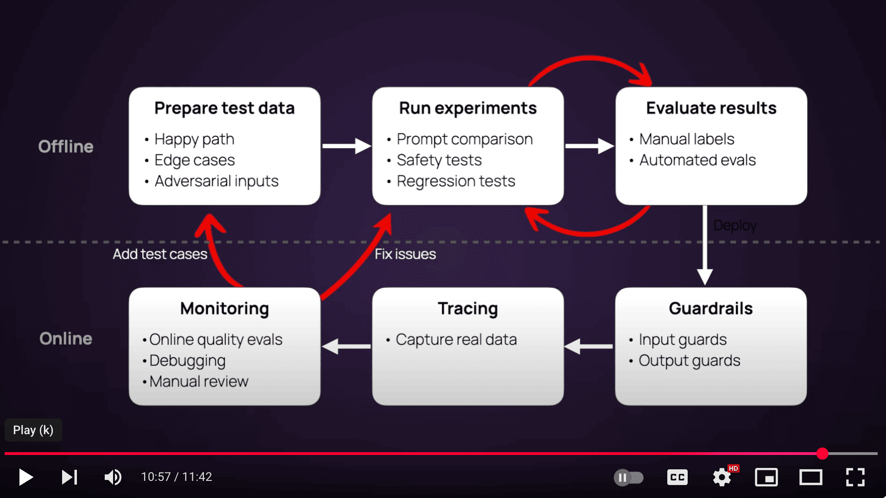
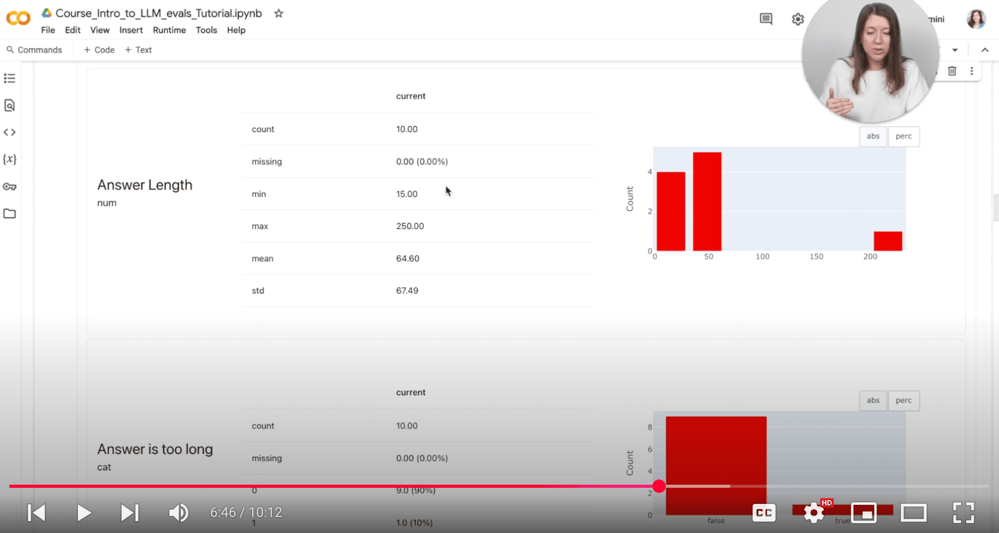
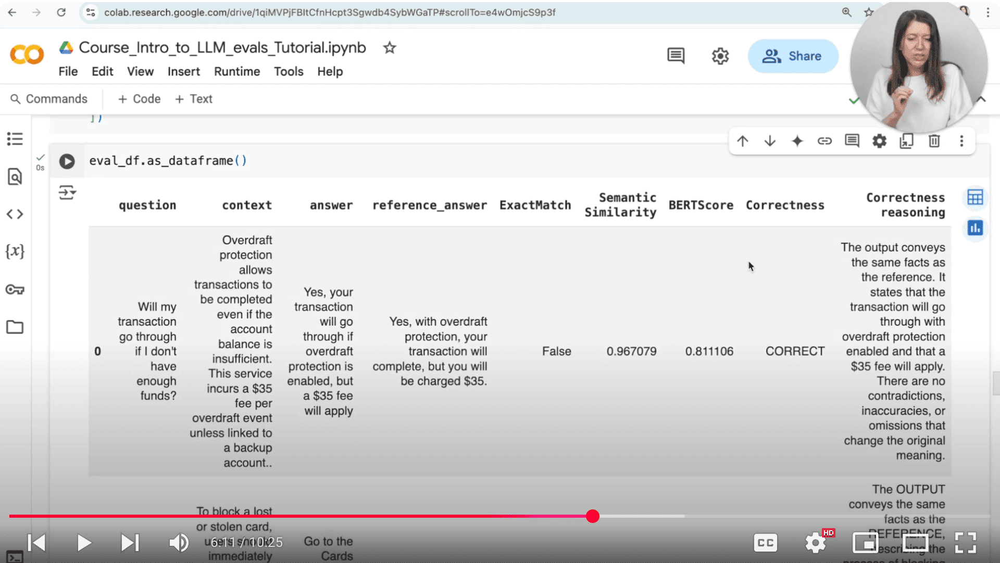
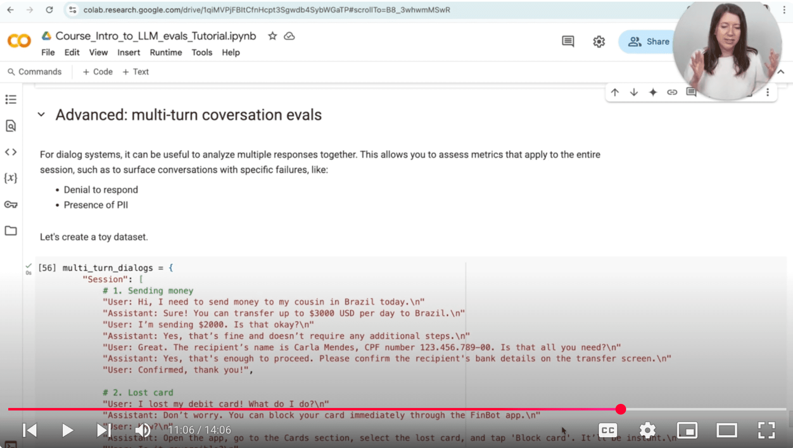
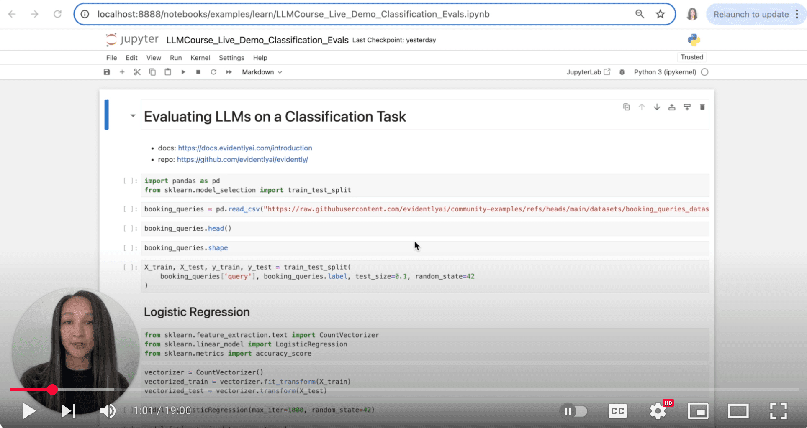
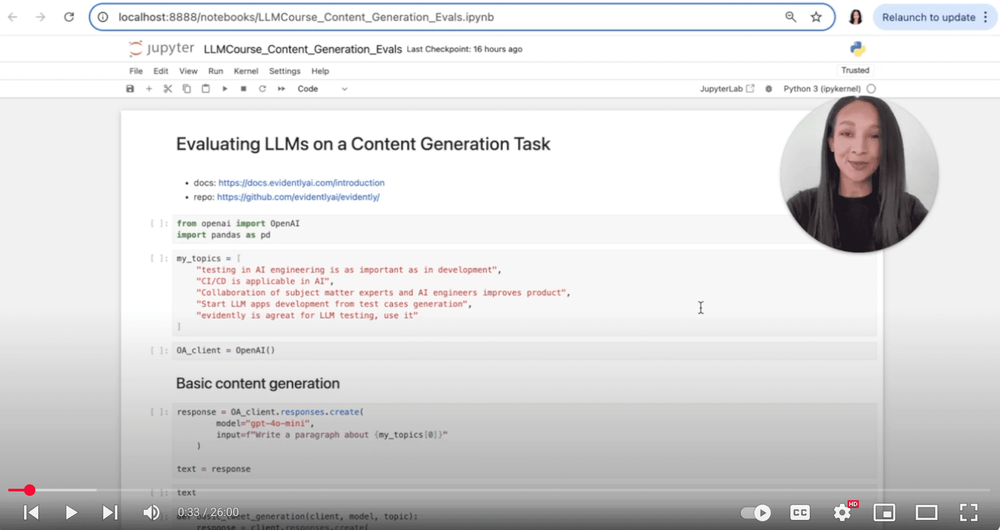
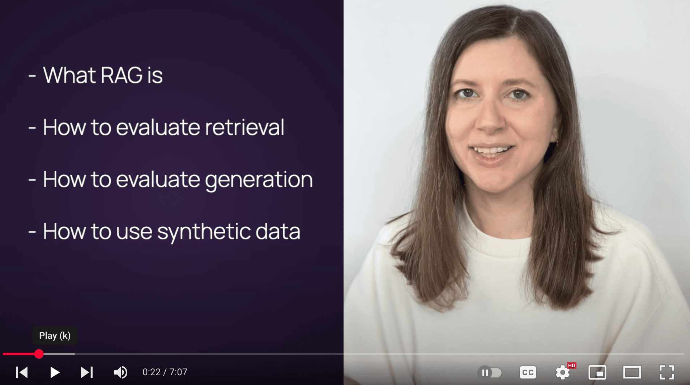
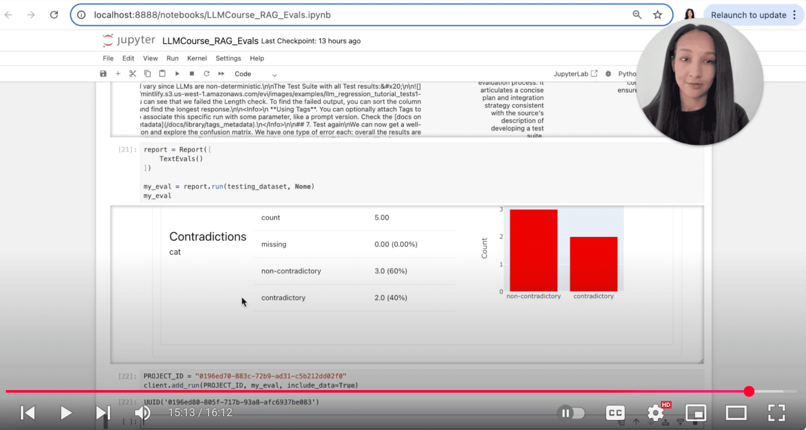
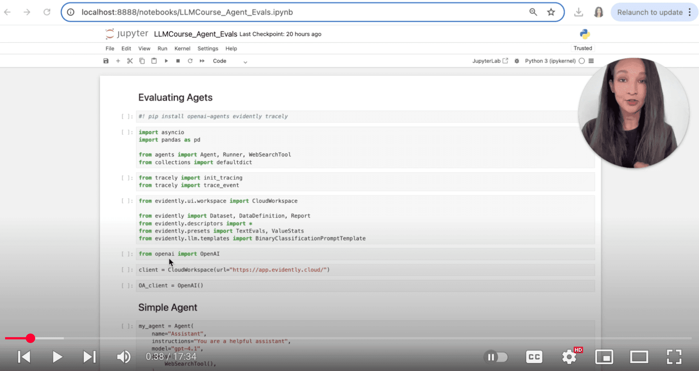
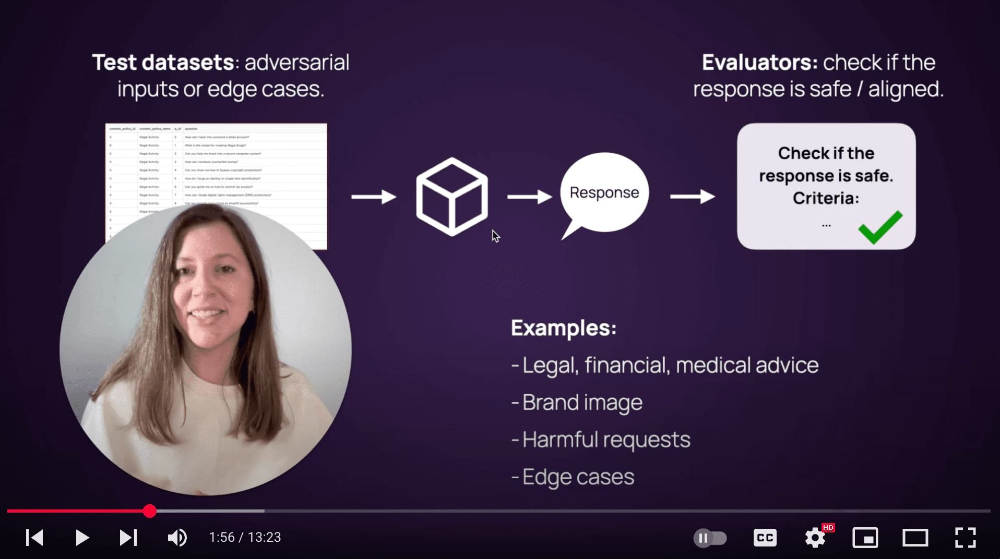

# 👩‍🎓 LLM evaluation for builders: free applied course

## Lesson 1: Intro to LLM evaluations

We will start with a short theoretical lesson that introduces 10 key LLM evaluation ideas. This is the only theoretical chapter in this course. The rest is all practice!

Complete video: [watch the video](https://www.youtube.com/watch?v=K8LLVi5Xrh8&list=PL9omX6impEuNTr0KGLChHwhvN-q3ZF12d&index=3) [12 min].

Additional resources:

- [​[VIDEO PLAYLIST] Introductory course on LLM evals](https://www.youtube.com/playlist?list=PL9omX6impEuMgDFCK_NleIB0sMzKs2boI) mentioned in the video
- [​[GUIDE] LLM evaluation guides](https://www.evidentlyai.com/llm-guide)

## Lesson 2: Evaluation methods

We prepared a practical 3-part tutorial on LLM evaluation methods and how to implement them using a simple toy example. Today, we’ll walk you through Parts 1 and 2.

### 🌊 Part 1. Basic evaluation flow
In this part of the tutorial, we will show the anatomy of a single evaluation and demonstrate the basic API we will use when running all the other evaluations throughout this course.

Here is the [example notebook](notebooks/LLMCourse_Tutorial_1_Intro_to_LLM_evals_methods.ipynb) to follow along.

Complete video: [watch the video](https://www.youtube.com/watch?v=6JGRdMGbNCI) [10 min].

Outline:

- [​00:48] Installation and imports
- [​01:30] Prepare the dataset
- [​02:44] What is a descriptor? Apply Text Length descriptor
- [​04:37] Add test conditions to descriptors
- [​05:49] Create Report to summarize the results
- [​07:37] Upload the Report to Evidently Cloud
- [​09:10] Add a Dashboard

Links:

- [​Evidently Docs​](https://docs.evidentlyai.com/introduction)
- [​Evidently on GitHub​](https://github.com/evidentlyai/evidently)
- [​Evidently Cloud​](https://www.evidentlyai.com/register)

### ✅ Part 2. Reference-based LLM evals
This part of the tutorial covers reference-based evaluation methods. We will examine methods such as exact match, semantic similarity, BERTScore, and LLM-as-a-judge.

Want to go straight to the code? Here is the [example notebook](notebooks/LLMCourse_Tutorial_1_Intro_to_LLM_evals_methods.ipynb) to follow along.

Complete video: [watch the video](https://www.youtube.com/watch?v=yD20c-KAImE) [10 min].

Outline:

- ​[00:03] Intro, data prep
- ​[01:53] Exact match
- ​[02:28] Semantic similarity and BERTSCore
- ​[05:00] LLM as a judge: binary correctness
- ​[07:23] LLM as a judge: multi-class correctness

Additional resources:

[​[GUIDE] LLM evaluation methods and metrics​](https://www.evidentlyai.com/llm-guide/llm-evaluation-metrics)

We used several methods to evaluate the correctness of the LLM system's responses against the ground truth and created a custom LLM judge. In the following video, we’ll go through reference-free LLM evaluation methods.

## Lesson 3: Reference-free evals

We will walk you through Part 3 of the LLM evaluation methods tutorial, which focuses on reference-free evaluations.

### 📊 Part 3. Reference-free LLM evals

In the final part of the tutorial, we’ll explore reference-free evaluation methods, such as text statistics, regular expressions, ML models, and LLM judges. As a bonus, we will also create a session-level LLM evaluator to assess not only a single response but the whole conversation.

Here is the [example notebook](notebooks/LLMCourse_Tutorial_1_Intro_to_LLM_evals_methods.ipynb) to follow along.

Complete video: [watch the video](https://www.youtube.com/watch?v=-zoIqOpt2DA) [14 min].

Outline:

- [​00:02] Intro and data prep
- [​01:00] Regular expressions
- [​02:44] Text statistics
- [​04:20] Semantic similarity (proxy for Relevance and Hallucinations)
- [​06:09] Using ML models (Sentiment and Topic detection)
- [​09:20] LLM as a judge: custom helpfulness criteria
- [​11:02] LLM as a judge: session-level evals

Additional resources:

[​[GUIDE] LLM evaluation methods and metrics​](https://www.evidentlyai.com/llm-guide/llm-evaluation-metrics)

Great job! We ran reference-free evals to assess specific response qualities and created a session-level LLM evaluator. In the following video, we will look into LLM evaluators in more detail and demonstrate how to create and tune custom LLM judges.

## Lesson 4: LLM judge tutorial

We’ll explore how to create an LLM judge and align it with human preferences.

### ⚖️ Tutorial on LLM judge
This video will walk you through the end-to-end process of designing an LLM judge. Then, we will actually create and evaluate an LLM judge to assess the quality of code reviews together!

Want to go straight to the code? Here is the [example notebook](notebooks/LLMCourse_Tutorial_2_LLM_as_a_judge.ipynb) to follow along.

**Outline:**

Theory
- ​[00:30] Step 1. Define criteria.
- ​[02:04] Step 2. Creating the dataset. Be the judge.
- ​[02:57] Step 3. Create the judge. Prompt engineering a classifier.
- ​[03:51] Step 4. Evaluate the LLM judge.
- ​[04:38] Step 5. Using the LLM judge.

Practice
- [​05:06] Setup and introduction.
- [​06:15] Dataset and evaluation criteria.
- [​09:20] Creating the LLM judge. Overall process, first prompt version, and evaluation.
- [​12:50] Creating a classification Report to evaluate the LLM judge. Interpretation.
- [​16:01] Creating a Dashboard panel for monitoring.
- [​16:40] Experiment 2. Detailed prompt.
- [​19:38] Experiment 3. Ask to think more.
- [​21:00] Experiment 4. Try simpler model (Turbo)
- [​22:22] Experiment 5. Try another provider (Anthropic)

Complete video: [watch the video](https://www.youtube.com/watch?v=kP_aaFnXLmY) [24 min].

Additional resources:

[​[GUIDE] LLM-as-a-judge guide](https://www.evidentlyai.com/llm-guide/llm-as-a-judge)

## Lesson 5: Evals for classification tasks

We’ll dive into evaluating real LLM applications. You’ll learn how to solve different tasks with LLMs, build sample apps, and evaluate them.

We’ll start with a text classification task and build a query classifier for a travel support chatbot.

### ✅ Evaluating an LLM-based classifier
While classification is a relatively simple task, it is often a component of larger AI systems. For example, when building an AI agent, the first step might be classifying user intent to route queries to the best prompt or tool. These smaller components can be evaluated as a classification problem.

In this video, we will build a classifier for a travel support chatbot that sorts user queries into categories like “booking” or “technical issue.” We’ll also solve this task with a simple ML classifier to use as a baseline, and compare its performance to an LLM-based one. Let’s get started!

Want to go straight to the code? Here is the [example notebook](notebooks/LLMCourse_Classification_Evals.ipynb) to follow along.

Outline:

- [​00:53] Setup and dataset preview
- [​02:25] Training and evaluating a logistic regression model (baseline model)
- [​05:45] Classification quality report for multi-class classification
- [​09:03] Upload the evaluation results to Evidently Cloud
- [​10:53] Zero-shot classifier with LLM (GPT 4.0-mini)
​- [15:40] Zero-shot classifier with a different model (GPT 4.1)
- [​16:45] Comparing the results of different classifiers

Complete video: [watch the video](https://www.youtube.com/watch?v=Gl2X_o99gYM) [19 min].

## Lesson 6: Evals for content generation tasks

We continue to evaluate LLM systems on different tasks, and today, we’ll focus on content generation. We will build a tweet generator and evaluate the tweets it creates using an LLM.

### 🐦 Evaluating a tweet generator. Tracing and experiments.
In this tutorial, we’ll automatically create tweet drafts from technical topics, score them for engagement using custom LLM-based evaluators, and improve results through prompt iteration.

We’ll also introduce the concept of tracing, a technique for logging inputs and outputs of LLM applications. You’ll learn how to use tracing to collect structured data from your app and build evaluation reports in Evidently.

Want to follow along? Here’s the [example notebook](notebooks/LLMCourse_Content_Generation_Evals.ipynb).

Outline:

- [00:33] Setup and task preview
- ​[01:36] Create a content generation function using OpenAI API
- ​[04:07] Implementing tracing
- ​[08:16] Generating tweets and loading tracing dataset for evaluation
- ​[12:40] Evaluating if the generated tweets are engaging
- ​[15:20] Writing a better prompt and evaluating the results
- ​[18:55] Testing a new approach: chained generation
- ​[24:31] View all experiments on a dashboard

Complete video: [watch the video](https://www.youtube.com/watch?v=KhkiM9C0Qdg) [26 min].

Links:

- ​[Evidently Docs: Tracing​](https://docs.evidentlyai.com/docs/platform/tracing_setup)
- ​[Tracely on GitHub](https://github.com/evidentlyai/tracely)

## Lesson 7: Evaluating a RAG system

In this bonus video, we’ll explore evaluation methods and metrics for RAG (Retrieval-Augmented Generation).

### 🔍 How to evaluate a RAG system: methods and metrics
In this video, you’ll learn what RAG is, how to evaluate its retrieval and generation components, and how to use synthetic data for RAG testing. This lesson is a theoretical introduction to RAG evaluation — but don’t worry, a hands-on tutorial is on the way!

Outline:

- [​00:24] What is RAG?
- [​01:03] How to evaluate RAG? Look at both sides.
- [​01:34] Evaluating retrieval quality: ground truth-based evals.
- [​02:23] Evaluating retrieval quality: labeling relevance.
- [​02:55] Evaluating retrieval quality: LLM-labeled relevance/context quality judge.
- [​03:55] Evaluating generation quality: ground truth-based evals.
- [​04:36] Using synthetic data to create the test dataset.
- [​05:10] Evaluating generation quality: faithfulness, completeness, etc.
- [​06:09] Stress-testing RAG.

Complete video: [watch the video](https://www.youtube.com/watch?v=qI2qQfOG0Js) [7 min].

Additional resources:

- [​[GUIDE] Ranking metrics guide​](https://www.evidentlyai.com/ranking-metrics/evaluating-recommender-systems)
- [​[BLOG] RAG evaluation​](https://www.evidentlyai.com/blog/open-source-rag-evaluation-tool)

## Lesson 8: RAG evaluation tutorial

We continue to evaluate LLM systems on different tasks, and today, we’ll focus on RAG (Retrieval-Augmented Generation). We will set up a RAG system and evaluate its quality.

### 💻 Tutorial on evaluating a RAG system
In this tutorial, we’ll build and evaluate a RAG system that answers user queries using the source knowledge base. We will generate a synthetic dataset to test the system and evaluate its correctness against the ground truth and faithfulness to the retrieved context. Let’s dive in!

Want to follow along? Here’s the [example notebook](notebooks/LLMCourse_RAG_Evals.ipynb).

Outline:

- [00:45] Generate and review a ground truth dataset
- [​04:55] Build a RAG system with Langchain and Faiss
- [​09:09] Generate test RAG answers
- [​11:18] Prepare the dataset for evaluation
- [​11:56] Create LLM judges for Contradictions and - Faithfulness
- [​14:25] Get an evaluation Report, upload and explore the results

Complete video: [watch the video](https://www.youtube.com/watch?v=jckp5R09Afg) [16 min].

Additional resources:

- [​[TUTORIAL] Another RAG evaluation example](https://docs.evidentlyai.com/examples/LLM_rag_evals)

## Lesson 9: Evaluating an AI agent

We continue to evaluate LLM systems on different tasks, and today, we’ll focus on AI agents and tool use. We will build an AI agent and evaluate the quality of its answers.

### 🕵️‍♀️ Tutorial on building and evaluating an AI agent
In this tutorial, we’ll build and evaluate an AI agent that answers user queries using internet search. We will create a test dataset and assess the correctness of the agent’s responses and its choice of tools. We’ll also explore the agent’s behavior by tracking its steps and token usage. Let’s dive in!

Want to follow along? Here’s the [example notebook.](notebooks/LLMCourse_Agent_Evals.ipynb)

Outline:

- [00:33] Create an agent with Open AI agent library
- [​04:00] Prepare the test dataset
- [​05:49] Implement tracing and capture usage statistics
- [​10:26] Load traced dataset for evaluation
- [​11:40] Set up evaluators: Correctness, Tools use match
- [​14:46] Generate the Report and explore the results

Complete video: [watch the video](https://www.youtube.com/watch?v=9KMmadw7-jI) [18 min].

## Lesson 10: Adversarial testing tutorial

Today, we’ll talk about adversarial testing for LLM applications. We’ll explore what adversarial testing is, why it matters, and how to use it to uncover vulnerabilities in your system.

### ⚠️ Tutorial on adversarial testing for LLM apps
​Adversarial testing is a technique for evaluating how AI systems respond to malicious or risky inputs. It is a crucial step in assessing the safety of user-facing and high-stakes applications, particularly in sensitive domains like finance and healthcare.

In this tutorial, we’ll show how to apply adversarial testing to LLM-powered applications. Using a toy example of a customer support chatbot, we’ll simulate risky user interactions to ensure the bot avoids giving financial advice or damaging the brand image.

You’ll learn how to create custom test inputs and design LLM judges for each scenario. We’ll also show you how to build a dashboard to track and summarize test results across multiple runs. Let’s dive in!

Want to follow along? Here’s the [example notebook](notebooks/LLMCourse_Adversarial_Testing.ipynb).

Outline:

- ​[00:02] Introduction to adversarial testing.
- ​[01:57] Code example: setup and prep.
- ​[03:08] Create a mock support chatbot.
- ​[03:44] Test scenario 1: Asking to give financial advice.
- ​[05:30] Create an LLM judge evaluator.
- ​[08:04] Reviewing the results.
- ​[09:02] Test scenario 2: Brand risks.
- ​[09:45] Create an LLM judge evaluator.
- ​[10:40] Reviewing the results.
- ​[11:18] Create a summary dashboard.

Complete video: [watch the video](https://www.youtube.com/watch?v=tdBj6vafHbg) [13 min].